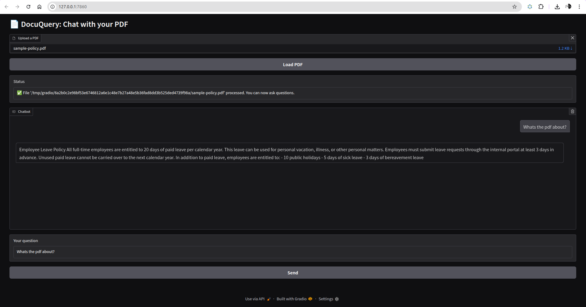

# 🧠 DocuQuery

DocuQuery is a local AI-powered chatbot that lets you upload any PDF file and ask questions about its content. It uses Hugging Face's sentence-transformers for semantic search and FLAN-T5 for answer generation — all running locally!

---



## 📦 Features

- 📤 Upload and analyze PDFs
- 💬 Ask questions in natural language
- 🤖 Get intelligent answers from your document
- 🧠 Powered by `all-MiniLM-L6-v2` + `flan-t5-base`
- 🖥️ Terminal and Gradio chatbot interfaces

---

## 🛠 Installation

```bash
git clone https://github.com/your-repo/DocuQuery.git
cd DocuQuery
python -m venv .venv
source .venv/bin/activate  # On Windows use: .venv\Scripts\activate
pip install -r requirements.txt
```

---

## 📄 File Structure

```
DocuQuery/
├── main.py                  # Terminal interface
├── chatbot_app.py           # Gradio chatbot interface
├── extract_text.py          # PDF text extraction
├── chunker.py               # Text chunking logic
├── embedder.py              # Embedding logic
├── retriever.py             # Similarity + FAISS search
├── answer_generator.py      # FLAN-T5 based answer generation
├── sample-policy.pdf        # Sample file for testing
├── requirements.txt         # Dependencies
└── README.md
```

---

## 🚀 Usage

### 🖥 Terminal

```bash
python main.py
```

Ask questions like:

```
> How many paid leave days are allowed?
> Can unused leave be carried over?
```

### 💬 Gradio Chatbot

```bash
python chatbot_app.py
```

Open your browser and:
- Upload a PDF
- Ask your question
- View answers in a friendly chat interface

---

## ✅ Requirements

- Python 3.8+
- `transformers`, `sentence-transformers`, `faiss-cpu`, `pdfplumber`, `scikit-learn`, `gradio`

Install with:

```bash
pip install -r requirements.txt
```

---

## 🧪 Test File

Use the included `sample-policy.pdf` or upload your own!

---

## 📄 License

MIT License © 2025